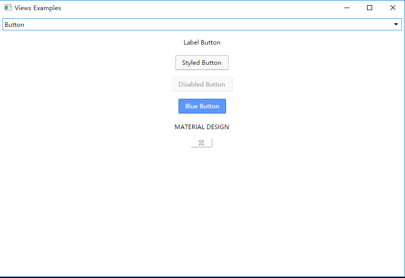

chromium基本运行时库
=========================

**修订说明**

 - 2016年4月26日 痞子飞猪<13317312768@qq.com> 从chromium49.0.2623.112抽取。

## 运行时库说明

抽取包仅包含base、net、cc、ui及其基本所需的第三方库。

时间仓促有多余的在所难免见谅！

### base

基础的工具类库，解决一些需要不得不处理的语言、编译器或操作系统
细节而导致的比必要的重复代码工作。

同时也替代一些C++本身不提供的或STL兼容性处理得不好的实现。

总之用了它你很爽！

### net

基础的网络操作工具函数库。

### ui

基础的跨平台界面库。

### 第三方库

#### brotli 

无损压缩算法，压缩数据使用LZ77算法(实现变种)。

#### sfntly

是一个字体工具包，可用于使用、编辑和创建基于 SFNT (http://en.wikipedia.org/wiki/Sfnt) 的字体。

#### skia

2D向量图形处理函数库，包含字型、座标转换，以及点阵图都有高效能且简洁的表现。

#### modp_b64

BASE64编解码库。

#### harfbuzz-ng

Harfbuzz是一个OpenType的构图引擎。

目前Harfbuzz有两个实现树，早期的那个称之为Harfbuzz，或者old harfbuzz。

而新的目前还处于比较活跃的开发状态的这个代码树，在整个代码的结构上面与前面有着非常大的区别，
为了区分新的这个称之为harfbuzz-ng。

#### gfx

Chromium专用的图形和渲染相关的助手代码。

#### breakpad

专门用于崩溃后处理的库。

#### boringssl

OpenSSL的一个分支（具体还不清楚有什么优化或不同？）

#### url_lib

URL处理库

#### crypto

加解密相关库。

#### sdch

http的sdch压缩客户端实现库。

#### sql

基于SQLite3的封装库。

#### testing

单元测试相关的工具代码（gtest）。

#### v8

V8引擎库。

_暂时保留_

#### angle

一个跨操作系统使用一套API来访问不同的3D引擎。包括 OpenGL ES 2.0 、OpenGL ES 3.0、Direct3D9、Direct3D11。

_chromium采用动态库的方式加载_

#### smhasher

一种非加密型哈希函数，适用于一般的哈希检索操作，具体见百科说明：

#### mesa

_已去掉了仅保留GL与EGL头文件引用_

Mesa 3D是一个在MIT许可证下开放源代码的三维计算机图形库，以开源形式实现了OpenGL的应用程序接口。

OpenGL的高效实现一般依赖于显示设备厂商提供的硬件，而Mesa 3D是一个纯基于软件的图形应用程序接口。

由于许可证的原因，它只声称是一个“类似”于OpenGL的应用程序接口。

由于Mesa 3D的API是和OpenGL相同，具体的OpenGL版本浏览Mesa 3D官方网站，
我们可以这么认为它就是OpenGL的软件模拟GPU光栅处理器的一个实现。
我们知道如果要实现一个OpenGL，其本身是一个设备器，不能实现窗体的透明，如果我想要实现窗体透明，又想要有3D的应用，可以试试它。

具体见百科说明：

#### khronos

包含EGL、OpenGL ES2、OpenGL ES3的头文件。

## 编译指南

### Windows

**环境要求**

1. VS2013
2. Windows SDK 8.1或[10](https://developer.microsoft.com/en-US/windows/downloads/windows-10-sdk)
2. python2.7

**环境变量**

_只有设置了如下的系统环境变量后才能使用GYP产生VS2013的工程文件（用于在VS2013中打开调试）_

    GYP_GENERATORS=msvs-ninja,ninja
    GYP_MSVS_VERSION=2013

**Win32编译**

    cd src
    python build\gyp_chromium build\chromium_extract.gyp
    ninja -C out\Debug chromium_extract
    ninja -C out\Release chromium_extract

**WIN64编译**

    set GYP_DEFINES=target_arch=x64
    python build\gyp_chromium build\chromium_extract.gyp
    ninja -C out\Debug_x64 chromium_extract
    ninja -C out\Release_x64 chromium_extract

**编译示例**

    ninja -C out\Debug views_example_exe

**示例截图**

